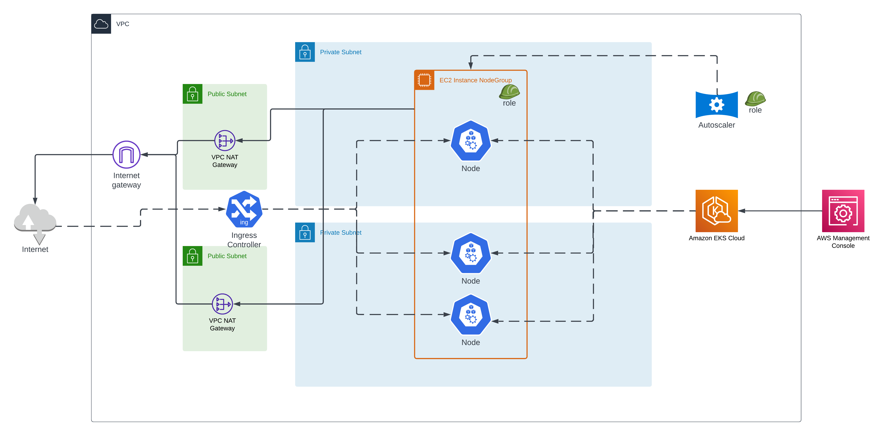

# AWS-EKS-Terraform

This repository contains Terraform configuration files to provision and manage the infrastructure resources on AWS required for deploying an Amazon Elastic Kubernetes Service (EKS) cluster. The infrastructure includes a Virtual Private Cloud (VPC) with public and private subnets, route tables, NAT gateways, and an Internet Gateway. Additionally, it provisions an EKS cluster with an autoscaling node group. It also sets up an OpenID Connect (OIDC) provider to assign IAM roles to Kubernetes service accounts and an IAM role for the autoscaler service account.

## Architecture


## Prerequisites
Before using this Terraform repository, ensure you have the following prerequisites:

1. An AWS account with appropriate permissions to create and manage the required resources. 
2. Terraform installed on your local machine. 
3. AWS CLI installed and configured with your AWS credentials. 

## Usage
To use this Terraform repository, follow these steps:
1. Clone the repository to your local machine:
2. Initialize Terraform by running the following command:
```
terraform init
```
3. Run the following command to preview the changes Terraform will make:
```
terraform plan
```
4. If the plan looks correct, apply the changes by running:
```
terraform apply
```

## Cleanup 
To destroy the infrastructure and tear down the EKS cluster, run the following command:
```
terraform destroy
```
